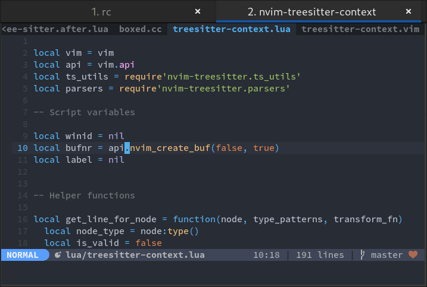

# nvim-treesitter-context

Lightweight alternative to [context.vim](https://github.com/wellle/context.vim)

## Requirements

Neovim >= v0.9.0

Note: if you need support for Neovim 0.6.x please use the tag `compat/0.6`.

## Screenshot



## Supported Languages
<details>
<summary>click to expand</summary

  - [x] `bash`
  - [x] `c`
  - [x] `c_sharp`
  - [x] `capnp`
  - [x] `clojure`
  - [x] `cmake`
  - [x] `cpp`
  - [x] `css`
  - [x] `cuda`
  - [x] `d`
  - [x] `dart`
  - [x] `elixir`
  - [x] `fish`
  - [X] `fennel`
  - [x] `fortran`
  - [x] `glimmer`
  - [x] `go`
  - [x] `graphql`
  - [x] `haskell`
  - [x] `html_tags`
  - [x] `ini`
  - [x] `janet` (using the "janet_simple" grammar)
  - [x] `java`
  - [x] `javascript`
  - [x] `json`
  - [x] `jsonnet`
  - [x] `julia`
  - [x] `latex`
  - [x] `lua`
  - [x] `liquidsoap`
  - [x] `markdown`
  - [x] `matlab`
  - [x] `nim`
  - [x] `nix`
  - [x] `norg`
  - [x] `objdump'
  - [x] `ocaml_interface`
  - [x] `ocaml`
  - [x] `odin`
  - [x] `php`
  - [x] `prisma`
  - [x] `python`
  - [x] `r`
  - [x] `ruby`
  - [x] `rust`
  - [x] `scala`
  - [x] `scss`
  - [x] `smali`
  - [x] `swift`
  - [x] `tcl`
  - [x] `teal`
  - [x] `terraform`
  - [x] `toml`
  - [x] `tsx`
  - [x] `typescript`
  - [x] `typoscript`
  - [x] `usd`
  - [x] `verilog`
  - [x] `vim`
  - [x] `yaml`
  - [x] `zig`
  - [ ] `ada`
  - [ ] `agda`
  - [ ] `arduino`
  - [ ] `astro`
  - [ ] `beancount`
  - [ ] `bibtex`
  - [ ] `bicep`
  - [ ] `blueprint`
  - [ ] `chatito`
  - [ ] `clojure`
  - [ ] `commonlisp`
  - [ ] `cooklang`
  - [ ] `cpon`
  - [ ] `devicetree`
  - [ ] `dhall`
  - [ ] `dockerfile`
  - [ ] `dot`
  - [ ] `ebnf`
  - [ ] `ecma`
  - [ ] `eex`
  - [ ] `elm`
  - [ ] `elsa`
  - [ ] `elvish`
  - [ ] `embedded_template`
  - [ ] `erlang`
  - [ ] `fennel`
  - [ ] `foam`
  - [ ] `fsh`
  - [ ] `func`
  - [ ] `fusion`
  - [ ] `gdscript`
  - [ ] `git_rebase`
  - [ ] `gleam`
  - [ ] `glsl`
  - [ ] `godot_resource`
  - [ ] `gomod`
  - [ ] `gosum`
  - [ ] `gowork`
  - [ ] `hack`
  - [ ] `hcl`
  - [ ] `heex`
  - [ ] `hjson`
  - [ ] `hlsl`
  - [ ] `hocon`
  - [ ] `html`
  - [ ] `htmldjango`
  - [ ] `http`
  - [ ] `jq`
  - [ ] `jsdoc`
  - [ ] `json5`
  - [ ] `jsonc`
  - [ ] `jsx`
  - [ ] `kdl`
  - [ ] `kotlin`
  - [ ] `lalrpop`
  - [ ] `ledger`
  - [ ] `llvm`
  - [ ] `m68k`
  - [ ] `menhir`
  - [ ] `mermaid`
  - [ ] `meson`
  - [ ] `nickel`
  - [ ] `ocamllex`
  - [ ] `pascal`
  - [ ] `perl`
  - [ ] `phpdoc`
  - [ ] `pioasm`
  - [ ] `po`
  - [ ] `poe_filter`
  - [ ] `proto`
  - [ ] `prql`
  - [ ] `pug`
  - [ ] `ql`
  - [ ] `qmldir`
  - [ ] `qmljs`
  - [ ] `query`
  - [ ] `racket`
  - [ ] `rasi`
  - [ ] `rego`
  - [ ] `rnoweb`
  - [ ] `ron`
  - [ ] `rst`
  - [ ] `scheme`
  - [ ] `slint`
  - [ ] `smithy`
  - [x] `solidity`
  - [ ] `sparql`
  - [ ] `sql`
  - [ ] `starlark`
  - [ ] `supercollider`
  - [ ] `surface`
  - [ ] `svelte`
  - [ ] `sxhkdrc`
  - [ ] `t32`
  - [ ] `thrift`
  - [ ] `tiger`
  - [ ] `tlaplus`
  - [ ] `todotxt`
  - [ ] `turtle`
  - [ ] `twig`
  - [ ] `ungrammar`
  - [ ] `v`
  - [ ] `vala`
  - [ ] `vhs`
  - [ ] `vue`
  - [ ] `wgsl`
  - [ ] `wgsl_bevy`
  - [x] `xml`
  - [ ] `yang`
  - [ ] `yuck`

</details>

## Configuration

(Default values are shown below)

Note: calling `setup()` is optional.

```lua
require'treesitter-context'.setup{
  enable = true, -- Enable this plugin (Can be enabled/disabled later via commands)
  max_lines = 0, -- How many lines the window should span. Values <= 0 mean no limit.
  min_window_height = 0, -- Minimum editor window height to enable context. Values <= 0 mean no limit.
  line_numbers = true,
  multiline_threshold = 20, -- Maximum number of lines to show for a single context
  trim_scope = 'outer', -- Which context lines to discard if `max_lines` is exceeded. Choices: 'inner', 'outer'
  mode = 'cursor',  -- Line used to calculate context. Choices: 'cursor', 'topline'
  -- Separator between context and content. Should be a single character string, like '-'.
  -- When separator is set, the context will only show up when there are at least 2 lines above cursorline.
  separator = nil,
  zindex = 20, -- The Z-index of the context window
  on_attach = nil, -- (fun(buf: integer): boolean) return false to disable attaching
}
```

## Commands

`TSContextEnable`, `TSContextDisable` and `TSContextToggle`.

## Appearance

Use the highlight group `TreesitterContext` to change the colors of the
context. Per default it links to `NormalFloat`.

Use the highlight group `TreesitterContextLineNumber` to change the colors of the
context line numbers if `line_numbers` is set. Per default it links to `LineNr`.

Use the highlight group `TreesitterContextSeparator` to change the colors of the
separator if `separator` is set. By default it links to `FloatBorder`.

Use the highlight group `TreesitterContextBottom` to change the highlight of the
last line of the context window. By default it links to `NONE`.
However, you can use this to create a border by applying an underline highlight, e.g:

```vim
hi TreesitterContextBottom gui=underline guisp=Grey
```

## Jumping to context (upwards)

```lua
vim.keymap.set("n", "[c", function()
  require("treesitter-context").go_to_context()
end, { silent = true })
```

## Adding support for other languages

See [CONTRIBUTING.md](CONTRIBUTING.md)

